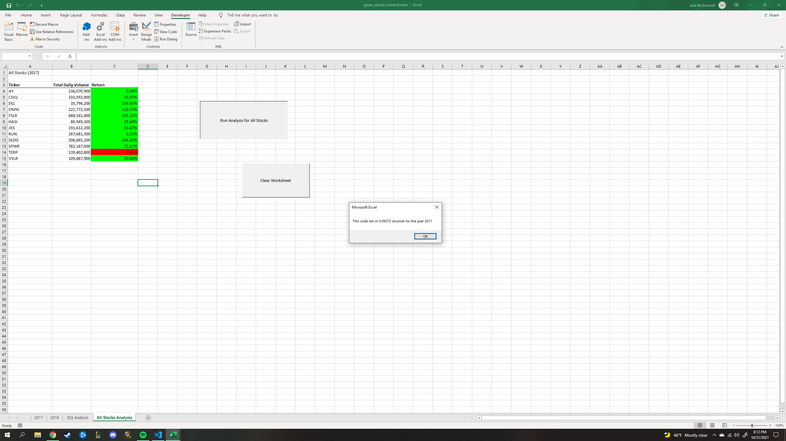
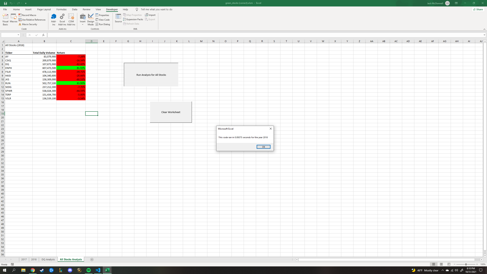

# stocks-analysis

Analysis and visual representation of data from excel files pertaining to kick-starter campaigns.

## Overview of Project
The purpose of this project was to introduce us to a widely utilized tool and, for many of us, a beginning coding language called VBA.  VBA basically allows us to write code within excel called macros that serve particular functions within the worksheets that can make navigating and accessing data quicker and more user-friendly.  We were given a decently large excel file containing information about different stocks purchased in 2017 and 2018 in addition to how much return they grabbed and various other details.  It was our job in the project to write a macro within the worksheets that creates and completely populates a table showing how well a stock did as well notify us on how fast our code was able to pour through all the data by using a custom-made button.  The Challenge specifically had us refactor or edit the code we had initially created in our modules to see if we could reduce the time the code took to run or in other words create more efficient code that runs quicker when people attempt to run it.  The module and challenge portion of the project really tapped into our knowledge of VBA's syntax and what kinds of code lines could create faster results.   

## Results

### Stock Performance in 2017 vs. 2018
Looking at the two tables of data below, I color coded stocks with positive returns to the investor by highlighting the return % green while a loss was highlighted in red.  Taking just a quick peek at the two charts, it becomes clear that stock returns in 2017 completely outclassed those in 2018.  Considering the 12 stock options presented in our project, 11/12 of them in 2017 created a profit margin for investors(or our theoretical character we are assisting named Steve) while only 2/12 options were profitable in 2018 which is quite a drastic change in the market environment.  I was not able to properly deduce whether the volume had a postive or negative correlation with the success of the stock over the two years but given a larger time frame of data to look at it's entirely possible there is some causation.







### Execution Speed for Original vs. Refactored Code
Our final task in the module and the project is to see how fast the code took to run when we originally scrpited it vs. how fast it was able to run with the edits and refactoring the challenge had us submit to it.  Before refactoring, when I would run the code through either 2017 or 2018's data the execution time varied between .67 and .69 seconds which doesn't seem slow at all unless you compare it to the image of our 2018 results below where it was able to run in roughly .09 to .1 seconds of a second!  More than half a second faster on an execution time all taking place in less than a second is quite significant when one considers the application of having something run half a second quicker like maybe app and touch sensitivity on smart phones; that would be pretty noticeable to most people.  The project's purpose of showing us how refactoring simple code like changeing the Ticker output arrays in our script to grab information off of Index numbers vs. climbing through the whole loop really helped categorize and access the information in the corresponding cells that much faster.  This segment of code below that indexed the various ticker titles of the stocks, I believe, was the driving force behind the faster execution speed vs. the original module code that did not include it.

```

    tickerIndex = 0

    Dim tickerVolumes(12) As Long
    Dim tickerStartingPrices(12) As Single
    Dim tickerEndingPrices(12) As Single
    
    For i = 0 To 11

        tickerVolumes(i) = 0
        tickerStartingPrices(i) = 0
        tickerEndingPrices(i) = 0
```


## Summary


### Advantages vs. Disadvantages of Refactoring Code (Module vs. Refactored VBA Script)

Some clear advantages of Refactoring your code are: A) Refactoring code could create a more efficient script that allows it to be executed faster which is considerably useful if you have a massive amount of data to pool from where waiting a long time for your code to produce the results you want could be quite tedious and, B) It teaches the coder to save time on their own writing where if you learn the tricks of refactoring and what kind of tools can be used within a language to help make the code more precise and neat than they will end up saving time in the future when they no longert have to repeat large amount of code lines because they are unaware of how to simplify it!

The main advantage for the the refactored VBA scrpit as far as I understand was this piece of code in the original version. 

```
    If Cells(i, 1).Value = ticker
```


Where-as without that the For loop would have to run and check the actual variable/value inputed for each cell before inputting the next subsequent command vs. being able to check the tickerIndex number immediately from our Index inclusion with the codeline.

```
    If Cells(i, 1).Value = tickers(tickerIndex)
```

Adding a way to categorize and isolate the data into "refractored" groups like this can help the computer simplify an otherwise slightly repetitive and disjointed command which in turn makes things go faster!  
The only disadvantage I can consider when writing the refractored code was simply the slight room for error you can have simply making an Index function for the tickers where was with the original code you can simply begin writing your For loop though this disadvantage seems relatively miniscule when you cconsider the ease of creating the Index in the first place and time/energy it could save you on future porjects if done correctly!
